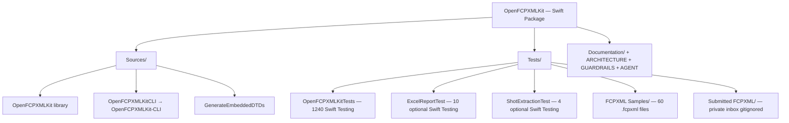
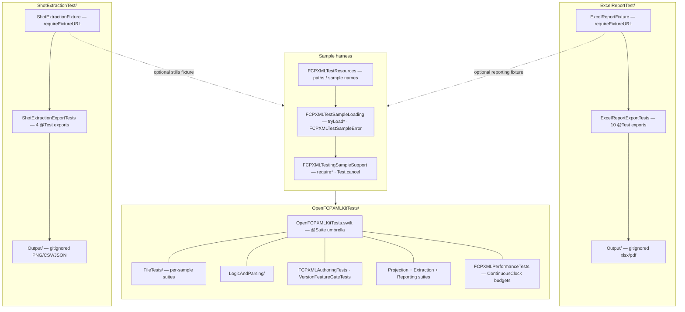
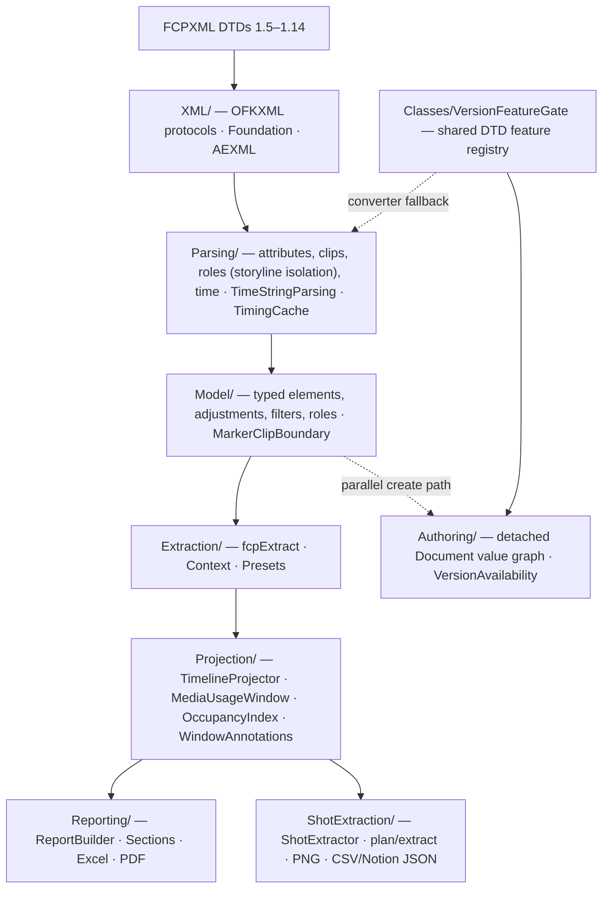
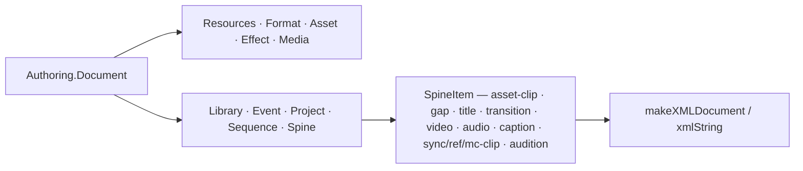
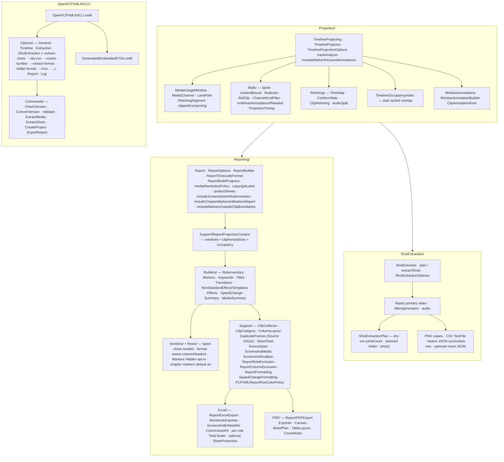
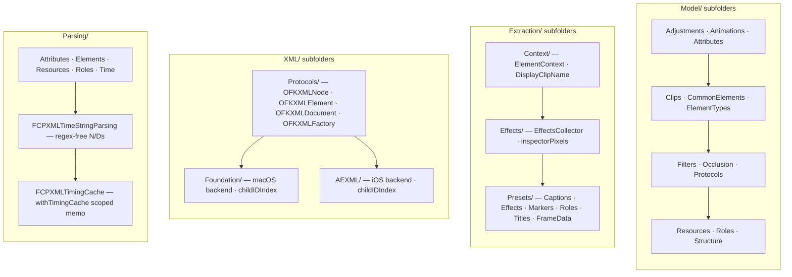

# OpenFCPXMLKit — Architecture & Conventions

A guide for contributors: project structure, architecture, naming, styling, and design decisions.

**See also:** [GUARDRAILS.md](GUARDRAILS.md) (must / must-not), [.cursorrules](.cursorrules), [AGENT.md](AGENT.md), [Tests/README.md](Tests/README.md), [Documentation/Coverage.md](Documentation/Coverage.md) (element / layer inventory).

---

## Table of Contents

- [1. Project overview](#1-project-overview)
- [2. Architecture](#2-architecture)
  - [2.1 Protocol-oriented design](#21-protocol-oriented-design)
  - [2.2 Single injection point for extensions](#22-single-injection-point-for-extensions)
  - [2.3 Facades](#23-facades)
  - [2.4 Concurrency](#24-concurrency)
  - [2.5 Cross-platform XML (iOS support)](#25-cross-platform-xml-ios-support)
  - [2.6 Error handling](#26-error-handling)
  - [2.7 Reporting and core layers](#27-reporting-and-core-layers)
    - [Excel export](#excel-export)
    - [PDF export](#pdf-export)
- [3. Project structure](#3-project-structure)
  - [3.1 Codebase map](#31-codebase-map)
    - [Package layout](#package-layout)
    - [Tests layout & harness](#tests-layout--harness)
    - [Library layer stack (bottom → top)](#library-layer-stack-bottom--top)
    - [Authoring (parallel create path — not in Reporting stack)](#authoring-parallel-create-path--not-in-reporting-stack)
    - [Reporting, Projection consume, and CLI](#reporting-projection-consume-and-cli)
    - [Model, Extraction, XML, and Parsing subfolders](#model-extraction-xml-and-parsing-subfolders)
  - [3.2 Library folders](#32-library-folders)
- [4. Naming conventions](#4-naming-conventions)
  - [4.1 Swift identifiers](#41-swift-identifiers)
  - [4.2 File names](#42-file-names)
  - [4.3 Special file names (collision avoidance)](#43-special-file-names-collision-avoidance)
- [5. Code style & file header](#5-code-style--file-header)
  - [5.1 Swift style](#51-swift-style)
  - [5.2 File header](#52-file-header-required-for-new-swift-files)
  - [5.3 Documentation](#53-documentation)
- [6. Design decisions](#6-design-decisions)
- [7. CLI](#7-cli)
- [8. Tests](#8-tests)
- [9. Git & quality](#9-git--quality)
- [10. References](#10-references)

---

## 1. Project overview

OpenFCPXMLKit is a **Swift 6** framework for Final Cut Pro FCPXML: parsing, creation, manipulation, and timecode operations (via SwiftTimecode). It is **protocol-oriented** and **dependency-injected**: core behaviour is behind protocols; default implementations are injectable; extension APIs that cannot take parameters use a single shared instance.

- **Package:** `OpenFCPXMLKit` (`swift-tools-version: 6.3`)
- **Products:** `OpenFCPXMLKit` (library, includes XLKit Excel export), `OpenFCPXMLKit-CLI` (executable), `GenerateEmbeddedDTDs` (internal build tool)
- **Targets:** macOS 26+, iOS 26+, Xcode 26+, Swift 6.3+
- **Repository:** https://github.com/TheAcharya/OpenFCPXMLKit
- **Dependencies:** SwiftTimecode 3.1.4+, SwiftExtensions 3.0.0+, SwiftSemanticVersion 1.0.0+, swift-log 1.14.0+, AEXML 4.7.0+, XLKit 1.1.8+, TextFile ([swift-textfile](https://github.com/orchetect/swift-textfile) 0.5.2+, Shot Extraction CSV), swift-argument-parser 1.8.2+ (CLI only), Foundation, CoreMedia, ImageIO.
- **FCPXML:** Versions 1.5–1.14 (DTDs included); Final Cut Pro frame rates (23.976, 24, 25, 29.97, 30, 50, 59.94, 60).
- **Tests:** **1254** tests listed in `swift test list` — **1240** in `OpenFCPXMLKitTests` + **10** optional `ExcelReportTest` + **4** optional `ShotExtractionTest` (all Swift Testing `@Test`; no XCTest); **60** sample `.fcpxml` files under `Tests/FCPXML Samples/FCPXML/`; private local inbox under `Tests/Submitted FCPXML/` (gitignored — never commit private FCPXML).

---

## 2. Architecture

### 2.1 Protocol-oriented design

All major operations are defined as **protocols** with both **sync** and **async/await** methods. Default implementations live in `Implementations/`; callers inject dependencies into `FCPXMLUtility` or `FCPXMLService`.

| Protocol(s) | Implementation |
|-------------|----------------|
| FCPXMLParsing, FCPXMLElementFiltering | FCPXMLParser |
| TimecodeConversion, FCPXMLTimeStringConversion, TimeConforming | TimecodeConverter |
| XMLDocumentOperations, XMLElementOperations | XMLDocumentManager |
| ErrorHandling | ErrorHandler |
| CutDetection | CutDetector |
| FCPXMLVersionConverting | FCPXMLVersionConverter |
| MediaExtraction | MediaExtractor |
| MIMETypeDetection | MIMETypeDetector |
| AssetValidation | AssetValidator |
| SilenceDetection | SilenceDetector |
| AssetDurationMeasurement | AssetDurationMeasurer |
| ParallelFileIO | ParallelFileIOExecutor |
| ServiceLogger | NoOpServiceLogger, PrintServiceLogger, FileServiceLogger |

Semantic and DTD validation use **concrete structs** (`FCPXMLValidator`, `FCPXMLDTDValidator`, `FCPXMLStructuralValidator`) that are injected; they are not behind protocols.

### 2.2 Single injection point for extensions

Extension APIs that **cannot take parameters** (e.g. `CMTime.fcpxmlString`, `XMLElement.fcpxDuration`) use **`FCPXMLUtility.defaultForExtensions`** (concurrency-safe). For custom services, use the **modular API** with the `using:` parameter (e.g. `CMTime+Modular`, `XMLElement+Modular`, `XMLDocument+Modular`).

- **Rule:** No hidden concrete types in extension APIs; use `defaultForExtensions` or inject via `using:`.

### 2.3 Facades

- **FCPXMLService** — Preferred facade: inject dependencies and call service methods (parse, convert, validate, save, media operations). Sync and async.
- **FCPXMLUtility** — Legacy/convenience facade; same dependencies and behaviour. Holds `defaultForExtensions`.
- **ModularUtilities** — `createService()` / `createCustomService()` for building a default or custom `FCPXMLService`; `validateDocument(_:)`; `processFCPXML(from:using:)`; `convertTimecodes(...)`.

### 2.4 Concurrency

- **Sendable** where appropriate; Swift 6 strict concurrency (`-strict-concurrency=complete`) in CI.
- **Foundation XML** (XMLDocument, XMLElement), the **OFKXML** protocol types (OFKXMLDocument, OFKXMLElement) that wrap them, and **SwiftTimecode** types are not Sendable. The codebase provides **async/await** APIs but avoids Task-based concurrency over these types.
- Use `async/await` for asynchronous operations; use `Task`/`TaskGroup` only where types are Sendable.

### 2.5 Cross-platform XML (iOS support)

- **XML abstraction:** All document/element access goes through **protocols** (OFKXMLNode, OFKXMLElement, OFKXMLDocument, OFKXMLFactory). On **macOS** the default backend is Foundation (FoundationXMLElement, FoundationXMLDocument, FoundationXMLFactory). On **iOS** the backend is AEXML (AEXMLBackendElement, AEXMLBackendDocument, AEXMLBackendFactory). Use **OFKXMLDefaultFactory()** so the correct backend is used for the current platform.
- **DTD validation:** Full DTD validation is macOS-only. **FCPXMLDTDValidator** on iOS uses **FCPXMLStructuralValidator** (root, version, resources, element allowlist) and may add a `structuralValidationOnly` warning.

### 2.6 Error handling

- **Sync:** `Result<T, FCPXMLError>` or `do`/`catch`.
- **Async:** `throw` and propagate `FCPXMLError` (e.g. `parsingFailed(Error)`).
- **Module errors:** `FCPXMLError`, `FCPXMLLoadError`, `FCPXMLExportError`, `FCPXMLBundleExportError`, `FinalCutPro.FCPXML.ParseError`, `TimelineError`. Parse failures from all layers surface as `FCPXMLError.parsingFailed`.

### 2.7 Reporting and core layers

Workbook **reporting** (`Reporting/`) sits at the top of the stack. It maps already-extracted FCPXML facts into row models and sheet sections. It is **not** where new FCPXML semantics should first be implemented.

When FCPXML grows more complex (nested sync-clips, compound clips, richer adjustments, role inheritance, occlusion, per-span metadata), extend the engine **bottom-up** so CLI, extraction presets, timeline tools, and reports share one foundation:

```text
XML/              OFKXML protocols and platform backends (Foundation, AEXML)
    ↓
Parsing/          Attribute and structure parsing (time, roles, clips, metadata)
    ↓
Model/            Typed elements, adjustments, filters, roles, occlusion
    ↓
Extraction/       fcpExtract, ExtractionScope, timeline/role context
    ↓
Projection/       TimelineProjection → MediaUsageWindow
    ↓
Reporting/        Row models, builders, sheet-specific presentation rules
    ↘
ShotExtraction/   Primary stills → PNG + CSV/Notion; planShots dry-run; reject video/titles/audio
                  (parallel consumer of Projection; independent of Reporting)
```

**Timeline Projection:** Mid-layer under `Sources/OpenFCPXMLKit/Projection/` that projects sequences into playable **media usage windows** (channel, lane path, retiming): identity and `timeMap`/`conform-rate` retiming; nested spines / anchored children and J/L cuts; container shells (`clip` / `sync-clip` / `gap`) bound **lane-less** contained media to the container’s own span while connected (`lane`) children keep their extent (Sign `containers-bound-their-content-not-their-anchors`); multicam active/all angles, ref-clip sequence unfold, audition mask, `video`/`audio` leaves, `ChannelKindFilter` / `srcEnable`. Host annotations on `mc-clip` / `ref-clip` (and other clip hosts); `includeMarkerAnnotations` / `includeKeywordAnnotations` opt in host marker/keyword collection; occluded hosts still emit **markers/keywords** while Titles/Transitions/Effects stay occupancy-gated. When any of Role Inventory, Markers, Keywords, Titles & Generators, Transitions, Effects, Speed Change, Media Summary, or Summary is enabled, `ReportBuilder` projects **once** per timeline and shares `ReportProjectionContext` (windows + `ProjectedClipAnnotations` + `TimelineOccupancyIndex`). Markers / Keywords / Titles / Transitions / Effects are **Projection-first** with Extraction fallback (also when Projection annotations filter to zero rows). Sequences omitting `tcFormat` default to NDF for absolute-time formatting. Excel/PDF remain presentation-only. **Shot Extraction** (`ShotExtraction/`) is a separate Projection consumer (still-image PNG + CSV/Notion); it must not invent Reporting-only walks. See Manual [12 — Timeline Projection](Documentation/Manual/12-Timeline-Projection.md) and [21 — Shot Extraction](Documentation/Manual/21-Shot-Extraction.md).

**1. Model and Parsing** — Add or extend typed coverage first:

- New element types in `FCPXMLElementType` and `Model/` (clips, adjustments, filters, resources).
- Attribute parsing in `Parsing/` and element extensions on `OFKXMLElement`.
- Shared value types (e.g. transform adjustments, volume spans) that any consumer can reuse.

**2. Extraction** — Expose consistent context for callers:

- Timeline absolute start/end via extraction context (`ExtractedElement`, `ElementContext`).
- Inherited roles, occlusion, sync/mc/ref-clip traversal rules in `Extraction/`.
- Presets and scope flags (`ExtractionScope`, `includeDisabled`, `occlusions`) rather than ad hoc XML walks.

**3. Reporting** — Keep thin:

- Builders prefer **Projection** facts (`ReportProjectionContext`) when available, with Extraction fallback for discovery-shaped sections (Markers, Keywords, Titles, Transitions, Effects).
- Sheet-specific **presentation policy** only: column order, string formatting (including `ReportTimecodeFormat`), sort order (numeric for Frames / Feet+Frames), inclusion allowlists (e.g. which custom filters appear on an effects sheet), global column exclusion (`ReportColumn`, `ReportColumnExclusion` including **`ensuringRowColumn`** / **`allowsInjectedRowColumn`** so **Row** is on all tabular Excel/PDF sheets by default; Role ▸ Subrole aliases include shell-friendly `Role > Subrole` / `Roles > Subrole`), format-aware timecode column headers, shared row text colours (`FCPXMLReportRowColorPolicy` — Excel and PDF colour from **typed row facts** via `fontColorHex(roleSubrole:categoryLabel:context:)` / Non-Std Kind APIs so `--exclude-column` never blanks colours or cell writes; Sign `row-colour-survives-column-exclusion`), workbook/PDF cell colours (`FCPXMLReportWorkbookExporter`, `RoleRowColorContext` on Excel; PDF applies the same policy via CoreGraphics), optional cover-sheet / cover-page branding (`Report.exportBrandingText` / `ReportWorkbookCoverSheet.visitURL`), four-row Excel cover (**A1** Created-by / **A2** Created-on / **A3** Visit / **A4** optional `copyrightLabel`; Sign `report-cover-four-row-branding`), optional Role Inventory **Screenshot** embeds (Excel-only; Sign `role-inventory-screenshots-excel-only`), and optional copyright / attribution (`ReportOptions.copyrightLabel` / `Report.copyrightLabel` — Excel cover **A4**; PDF cover below Created-by / Created-on / Visit; PDF footer centre; CLI `--label-copyright`).
- `ReportOptions.excludeDisabledClips` flows into Extraction scope and `TimelineProjectionOptions.forReport` so disabled clips are omitted consistently.
- `ReportOptions.mediaResolutionPolicy` (`.failSoft` / `.failLoud`; CLI `--media-resolution`) controls whether projection failures abort the build; missing files on disk always remain Media Summary content.
- `ReportOptions.mediaSummaryDistinguishProxyAndOriginal` (CLI `--media-summary-distinguish-proxy`) splits Missing Original / Missing Proxy columns when Projection windows carry both URL kinds.
- `ReportOptions.timecodeFormat` is stored on `Report.timecodeFormat` and drives cell strings plus Excel/PDF header suffixes (e.g. `Timeline In (frames)`).
- `ReportOptions.copyrightLabel` is stored on `Report.copyrightLabel` (whitespace-normalized) and applied by Excel cover **A4** and PDF cover/footer rendering.
- `ReportOptions.includeScreenshotsInRoleInventory` (CLI `--include-role-inventory-screenshots`) adds a Role Inventory **Screenshot** column after **Row** and embeds Source In frame grabs at Excel export only (480px max long edge; prefers `original-media`, then `proxy-media` if original is missing/unreadable; PDF ignores).
- `ReportWorkbookCoverSheet.visitURL` customizes the Excel **A3** / PDF Visit line (API / GUI only; default OpenFCPXMLKit GitHub).
- `ReportOptions.includeChapterMarkersInMarkersReport` defaults to **`true`** (Markers sheet includes `chapter-marker` with Type = Chapter; Excel Type filter or API `false` to omit). No separate CLI chapter flag — `--report-markers` / `.full` / `.markersOnly` include chapters.
- `ReportOptions.includeMarkersOutsideClipBoundaries` (CLI `--include-markers-outside-clip-boundaries`) controls whether markers whose `start` is outside the host clip media range are included; when `true`, the Markers sheet gains a trailing **Hidden** column (✓/✗). Default omits those markers (FCP Tags/timeline behaviour). Distinct from FCPXML 1.13+ `hidden-clip-marker`. Boundary helper: `FCPXMLMarkerClipBoundary` / Projection `WindowMarkerAnnotation.isOutsideClipBoundaries`.
- `ReportOptions.protectSheets` (CLI `--protect-sheets`) is stored on `Report.protectSheets` and applied by Excel export only: XLKit `SheetProtection` on every worksheet (edit lock, no password). **Not** file-open encryption; PDF ignores this flag.
- **Nested connected Role Inventory hosts:** Retain negative-lane connected hosts (and fully occluded hosts) when they have an **own role assignment** — active `audio-channel-source`, asset-clip `audioRole`/`videoRole`, or first-gen `audio`/`video` child `role` — via Parsing `fcpHasStandaloneConnectedInventoryAssignment` consumed by `RoleInventoryClipCollector` (Sign `connected-role-inventory-survives-nesting`). Hosts with no own assignment may still fold into the parent. This is inventory-selection policy, not Projection occupancy.
- **Secondary storyline roles stay local:** Nested `<spine>` children and connected (`lane != 0`) story clips do not inherit the parent clip’s video/audio roles (`_fcpInheritedRoles` stops at that boundary). Role Inventory emits the timeline `mc-clip` host, not unfolded angle interiors (Sign `secondary-storyline-clips-keep-own-roles`).
- **Under-spine titles / leaf video:** Titles & Generators, Role Inventory, Markers, and Effects honour `Title.role` / Projection host video roles via `ReportFormatting.titleRoleSubrole` (default **Titles** when omitted). Negative-lane leaf `<video>` / generators are inventoried; negative-lane leaf `<audio>` still folds into hosts (Sign `title-roles-honor-attribute`). Parsing/Extraction/Projection already discover these elements.
- Build / progress order is **`ReportBuildPhase.enabledPhases(for:)`** (product / workbook order: Selected Roles Inventory first, then Markers → Keywords → Titles & Generators → Transitions → **Non-Std Effects & Templates** → Video & Audio Effects → Speed Change Effects → Summary → Media Summary; includes `.projecting` when sections consume Projection). `ReportBuilder` and CLI/GUI progress share this list.
- **Timeline resolution** for `buildReport` / `ReportBuilder` uses **`FinalCutPro.FCPXML.allReportTimelineSources()`** (defined on `FCPXMLProperties`): every `<project>` sequence, plus event-level compound clips (`ref-clip` → `media`/`sequence`) when FCP exported a compound clip with no `<project>`. Prefer a real project when both exist. `ReportOptions.projectName` / CLI `--report-project` match project or compound-clip display names. Discovery belongs on `FCPXML` (Classes); Reporting only consumes `ReportTimelineSource`.
- **Summary Excel/PDF layout:** project title in **B1** (narrow **Row** column A; generous title width on B; **A1** / **C1–E1** black banner fill). Visual-section **subtotal** (`SummaryRoleDurationRow.isSectionSubtotal`): black fill + bold white **body-size** text across A–E (Excel) / full table width (PDF); no blank separator. **`% of Total`** is a fraction (`roleSeconds / projectSeconds`); Excel uses `0.0%` numeric format; PDF uses `formattedPercentOfTotal` for the same display. **Per-role inventory Total footer:** blank row then **Total:** under Timeline Out + optimistic Clip Duration sum (black/white header style; omitted when those columns are excluded; not overlap-aware). **Non-Std Effects & Templates** uses Row + Name/Kind/Status/Path/UID; Kind/UID-based row colours. **Empty enabled section sheets:** keep headers + one `ReportEmptySectionStatus` / Media Summary **No Missing Media** status row (Sign `empty-enabled-report-sheets-keep-status`); per-role inventory tabs may still omit when empty. **PDF cover:** black header band with white `info.circle` + “About This PDF Export”; body notes reference default/excludable Row; branding stack matches Excel (**Created-by** → **Created on** → **Visit** → optional `copyrightLabel`; Sign `report-cover-four-row-branding`); copyright also centred in the running footer.
- Do **not** duplicate timeline math, role resolution, or element traversal that belongs in Extraction/Model/**Projection**.

**Where to put a change**

| Concern | Layer |
|--------|--------|
| New `adjust-*` or `filter-*` element understood from XML | Model, Parsing |
| Correct absolute timeline for a nested clip or effect span | Extraction (context); **Projection** when composed retiming / channel windows are required |
| Playable media occupancy (A/V channels, nested lanes, speed/reverse/conform, split edits, audition/multicam visibility) | **Projection** (`TimelineProjection` / `MediaUsageWindow`) |
| Discover project vs standalone compound-clip report timelines | Classes (`allReportTimelineSources` / `ReportTimelineSource`); Reporting resolves via that API |
| Which rows appear on a given workbook sheet | Reporting |
| Nested connected Role Inventory host inclusion (own `audioRole` / `videoRole` / channel-source / first-gen child `role`; same rule for full occlusion) | Parsing (`fcpHasStandaloneConnectedInventoryAssignment`) + Reporting (`RoleInventoryClipCollector`); Projection occupancy already correct |
| Secondary storyline / connected clips must not inherit the host clip’s roles; Role Inventory skips unfolded `mc-angle` interiors | Parsing (`_fcpInheritedRoles` / `_fcpRoleInheritanceContributingElements`) + Reporting (`isUnfoldedMulticamInterior`); Sign `secondary-storyline-clips-keep-own-roles` |
| Title Role ▸ Subrole / under-spine leaf `<video>` inventory (honour `Title.role`; do not hard-code Titles; skip only negative-lane leaf `<audio>`) | Reporting (`ReportFormatting.titleRoleSubrole`, `RoleInventoryClipCollector.shouldSkipLeafMedia`); Parsing/Extraction/Projection already supply facts (Sign `title-roles-honor-attribute`) |
| Title Text / Font (same-line `text-style` runs concatenate; ` | ` only between `<text>` blocks) | Model (`Title.concatenatedDisplayText` / `displayFontSpecifications`); Reporting stays thin (Sign `title-text-same-line-runs-concatenate`) |
| Transform / blend / filter inspector values on Effects and Role Inventory **Effects** | Model (`TransformAdjustment.componentSamples`, `inspectorPixels` via sequence height); Extraction `ExtractedEffect` (Position already in Inspector pixels); Reporting formats FCP units (Scale %, Rotation degrees, Opacity %, Blend Mode labels); filter `param` values stay pass-through (Sign `effect-settings-match-fcp-display`; lock with `FCPXMLInspectorDisplayUnitsTests`) |
| Column labels, timecode strings, enabled checkmarks | Reporting |
| Timecode display mode (SMPTE / Frames / Feet+Frames / HH:MM:SS) and header suffixes | `ReportOptions.timecodeFormat` → `Report.timecodeFormat` → Formatting + Excel/PDF export |
| Optional copyright / attribution line (Excel cover A4; PDF cover + footer centre) | `ReportOptions.copyrightLabel` → `Report.copyrightLabel` → Excel / PDF export (CLI `--label-copyright`) |
| Optional Visit URL (Excel cover A3; PDF cover) | `ReportWorkbookCoverSheet.visitURL` (default OpenFCPXMLKit GitHub; API / GUI only) |
| Optional Role Inventory Screenshot column + Excel Source In embeds (480px max long edge; prefer original, proxy if original missing/unreadable; PDF omits) | `ReportOptions.includeScreenshotsInRoleInventory` → Excel export (CLI `--include-role-inventory-screenshots`) |
| Markers outside host clip media range + Markers **Hidden** column | `ReportOptions.includeMarkersOutsideClipBoundaries` → Markers builder / Projection annotations (CLI `--include-markers-outside-clip-boundaries`) |
| Chapter markers on Markers sheet | `ReportOptions.includeChapterMarkersInMarkersReport` (default **`true`**; no CLI chapter flag) |
| Excel worksheet edit lock on every sheet (not encryption) | `ReportOptions.protectSheets` → `Report.protectSheets` → `FCPXMLReportWorkbookExporter` (CLI `--protect-sheets`; PDF ignores) |
| Build / progress / GUI section order | `ReportBuildPhase.enabledPhases(for:)` (Non-Std Effects & Templates before Video & Audio Effects) |
| Per-role Clip Duration Total footer (Excel/PDF) | `RoleInventorySheetTotal` (presentation-thin; optimistic sum; not overlap-aware) |
| Duplicate Frames inventory column | `RoleInventoryDuplicateFrames` — overlap of inventory Source In + Source Duration by `resourceID` (never `timeMap` `mediaIn`/`mediaOut`; Sign `duplicate-frames-match-source-in-out`) |
| Non-Std Effects & Templates sheet | Document `<effect>` resources (non-Apple / missing `src`); Row + Name/Kind/Status/Path/UID; Kind/UID row colours via `bucket(forNonStandardKind:uid:)` |
| Effects Role ▸ Subrole preference | `RoleDisplayPreference.preferredRole` — effects contexts type-filter video/caption vs audio; `.builtIn` uses FCP default main-role names only |
| Omit `enabled="0"` clips from all timeline sections | `ReportOptions.excludeDisabledClips` → Extraction scope + `TimelineProjectionOptions.forReport` |
| Projection failure abort vs continue | `ReportOptions.mediaResolutionPolicy` (`.failSoft` / `.failLoud`; CLI `--media-resolution`) |
| Media Summary Missing Original / Missing Proxy columns | `ReportOptions.mediaSummaryDistinguishProxyAndOriginal` (CLI `--media-summary-distinguish-proxy`) |
| Omit named columns from every applicable sheet (incl. **Row** on all tabular sheets + PDF injection; Role ▸ Subrole aliases `Role > Subrole` / `Roles > Subrole`) | `ReportOptions.excludedColumns` → `Report.excludedColumns` → Excel and PDF export (`ensuringRowColumn` / `allowsInjectedRowColumn`) |
| Omit named roles from every role-bearing sheet (inventory, markers, keywords, titles, effects, speed change, summary durations); full `Main ▸ Sub` matches bare main; raw FCP `Main.Sub` normalizes; Excel-truncated sheet tabs (`sheetTabName`, 31 chars) match full Role ▸ Subrole | `ReportOptions.excludedRoles` → `ReportRoleExclusion` at build time (Sign `excluded-roles-apply-to-all-sheets`) |
| Timeline Out / Source Out as last visible frame (Duration unchanged; Projection half-open) | `ReportFormatting.outTimecodeString(fromExclusiveEnd:)` (Sign `report-out-is-last-visible-frame`) |
| Contained media duration inside a trimmed `<clip>` / `<sync-clip>` (lane-less children) | **Projection** (`SpineProjection` composes a container identity `RetimingSegment`; Sign `containers-bound-their-content-not-their-anchors`) |
| Role Inventory Source Duration / Source Out on a retimed clip | Reporting (`RoleInventorySourceSpan` from Projection speed / `timeMap`; Sign `retimed-source-duration-follows-speed`) |
| Speed Change one row per timeline usage / speed percent / Role ▸ Subrole | Reporting (`SpeedChangeEffectsReportBuilder` usage runs; `SpeedChangeFormatting.averageScale`; `ReportFormatting.retimeRoleSubrole`; Signs `speed-change-row-per-timeline-usage`, `speed-percent-is-media-over-timeline`, `retime-roles-default-like-effects`) |
| Scoped `conform-rate` memoisation for a large-document walk | Parsing (`FinalCutPro.FCPXML.withTimingCache(_:)`; Sign `timing-cache-is-read-only-scoped`) |
| Workbook/PDF row text colours (inventory role category; section-sheet inference; Non-Std Kind/UID; Summary B1 banner + subtotal banner + black data; Media Summary red paths; marker-type colours) — **from typed models, independent of excluded columns** | `FCPXMLReportRowColorPolicy` semantic APIs (+ `FCPXMLReportWorkbookExporter` on Excel; PDF renderer applies same policy; Sign `row-colour-survives-column-exclusion`) |
| Missing media path list | Media Summary builder (`mediaBaseURL` for relative paths) |

**Workflow when a report gap appears**

1. Confirm whether the fact already exists in Model, Extraction, or Projection; use it if so.
2. If the gap is occupancy/retiming/channel visibility, implement or extend **Projection**. If the raw XML fact is missing, implement it in Model/Parsing, then Extraction.
3. Only then add or adjust Reporting builders to map that fact to rows.
4. Add **core** tests (parsing, extraction, projection, occlusion, roles) alongside **report** integration tests that assert row shape against an optional local FCPXML fixture.

#### Excel export

Lives under **`Reporting/Excel/`** and serialises `Report` to XLKit workbooks via `ReportExcelExport` and `FCPXMLReportWorkbookExporter`; it applies column exclusion (including format-suffixed timecode headers and universal **Row** via `ensuringRowColumn`), **always writes remaining cell values** (colour is not a gate for writing), `Report.timecodeFormat` header suffixes, tabular header styling (black fill, white bold text), Summary project title in **B1** with **A1**/**C1–E1** banner fill and narrow Row column A, visual-section subtotal banner (bold white body text), `% of Total` as `0.0%` numeric cells, per-role **Total:** footers, cover-sheet branding (**A1** Created-by / **A2** Created-on / **A3** Visit / optional **A4** `copyrightLabel`; Sign `report-cover-four-row-branding`), optional Role Inventory **Screenshot** embeds via `FCPXMLReportWorkbookScreenshotEmbedder` + `RoleInventoryScreenshotGrabber` (480px max long edge; prefer original, proxy if original missing/unreadable; Signs `role-inventory-screenshots-excel-only`, `role-inventory-screenshots-prefer-original`), sheet-specific row text colours from typed models (including Non-Std Kind/UID; Sign `row-colour-survives-column-exclusion`), and optional **`Report.protectSheets`** (XLKit `SheetProtection` on every sheet — edit lock only) but should not introduce new FCPXML interpretation.

#### PDF export

Lives under **`Reporting/PDF/`** and serialises the **same** `Report` to a multi-page A4 landscape PDF via `ReportPDFExport` and `FCPXMLReportPDFExporter` (CoreGraphics). Build the report once; export to Excel, PDF, or both. PDF respects the same section flags, `excludedColumns` (including **Row** / `allowsInjectedRowColumn`), `timecodeFormat`, role/disabled-clip filtering, `copyrightLabel`, and row colours from typed models (including Summary subtotal banners and Non-Std Kind colours; Sign `row-colour-survives-column-exclusion`). Summary **`% of Total`** uses `formattedPercentOfTotal` to match Excel `0.0%` display. PDF-only presentation: cover page with black **“About This PDF Export”** header band + white `info.circle` (`FCPXMLReportPDFCoverNotes`); branding stack **Created-by** → **Created on** → **Visit** (`exportVisitURL`) → optional `copyrightLabel` (same subtitle font/size; Sign `report-cover-four-row-branding`); running footer left branding + centred copyright + page number (footer font/size); **ignores** Role Inventory screenshots; dynamic table of contents with **accent-palette colour chips** and light **content-tint washes** keyed to each sheet title’s sequential `colorIndex` (same index as per-sheet content tints, including role sheets via `FCPXMLReportPDFSheetPlan`); per-sheet tinted content zones across vertical and horizontal continuations; table columns measured then **expanded to fill content width** when leftover space remains after packing/`excludedColumns` (`FCPXMLReportPDFTableLayout`; pinned Row); horizontal/vertical table pagination; ellipsis truncation. These layout helpers are **internal** — public API remains `ReportPDFExport` / `Report` / `ReportOptions`. CLI: `--create-pdf` and `--label-copyright` (with `--report`).

---

## 3. Project structure

### 3.1 Codebase map

The package builds one library, one CLI executable, and one internal build tool. The diagrams below read **top to bottom**. The library is layered bottom-up (see §2.7): **FCPXML DTDs** and the platform-agnostic **XML** layer feed **Parsing**, which builds the typed **Model**, which **Extraction** exposes with timeline/role context, which **Projection** turns into playable media windows, which **Reporting** maps into workbook/PDF sheets. **ShotExtraction/** is a parallel Projection consumer (still-image PNG + CSV/Notion JSON). Cross-cutting subsystems (Classes, Implementations, Protocols, Services, Timeline, Export, Validation, etc.) sit alongside that pipeline.

#### Package layout



#### Tests layout & harness



#### Library layer stack (bottom → top)



#### Authoring (parallel create path — not in Reporting stack)



#### Reporting, Projection consume, and CLI



#### Model, Extraction, XML, and Parsing subfolders



**Cross-cutting library folders** (alongside the layer stack): Analysis, Annotations, Authoring, Classes (incl. `VersionFeatureGate`), Delegates, Errors, Extensions (+Modular, +Codable), Implementations, Protocols, Services, Utilities, Export, Timeline, Timing, Validation, FileIO, Media, Logging, Format. Root: `Version.swift`.

**Tests** (see §8 and the Tests layout mermaid above): Swift Testing only; harness under `OpenFCPXMLKitTests/`; optional `ExcelReportTest/` and `ShotExtractionTest/`; public `FCPXML Samples/`; private `Submitted FCPXML/`.

### 3.2 Library folders

Source layout under **`Sources/OpenFCPXMLKit/`**:

| Folder | Purpose |
|--------|---------|
| **Analysis** | EditPoint, CutDetectionResult (cut detection). |
| **Authoring** | Detached (non-live) document value graph under `FinalCutPro.FCPXML.Authoring` — independent structs that encode/decode via explicit `Element` protocol + `VersionAvailability` omit-on-write (no Mirror/property-wrapper codecs; parallel to live `Model/` wrappers and `Export/` Timeline path). Spine coverage includes asset-clip, gap, title, transition, video, audio, caption, sync-clip, ref-clip, mc-clip, audition; resources include format/asset/effect/media (compound sequence + multicam). Do not use inside Reporting. Shared DTD feature introductions: ``FinalCutPro/FCPXML/VersionFeatureGate`` (also backs ``FCPXMLVersionConverter`` fallback strip lists). See Manual [08 — Detached Authoring](Documentation/Manual/08-Detached-Authoring.md). |
| **Classes** | FinalCutPro, FCPXML, FCPXMLElementType, FCPXMLUtility, FCPXMLVersion, FCPXMLVersionFeatureGate, FCPXMLRoot, FCPXMLRootVersion, FCPXMLInit, FCPXMLProperties (`allProjects`, `allTimelines`, `allReportTimelineSources` / `ReportTimelineSource` for project + standalone compound-clip report timelines). |
| **Delegates** | AttributeParserDelegate, FCPXMLParserDelegate (internal). |
| **Errors** | FCPXMLError, FCPXMLParseError, TimelineError. |
| **Extensions** | CMTime, XMLElement, XMLDocument (+Modular, +Codable, and non-modular). FCPXML extensions operate on OFKXMLElement/OFKXMLDocument protocol types. |
| **Implementations** | Default implementations of all protocols above. |
| **Protocols** | All operation protocols. |
| **Services** | FCPXMLService. |
| **Utilities** | ModularUtilities, FCPXMLTimeUtilities, FCPXMLUID, FCPXMLCodableConverter, EmbeddedDTDProvider, FCPXMLDTDAllowlistGenerator, ProgressBar, ProgressBarStyle, SequencePlusAnySequence, XMLElementAncestorWalking, XMLElementSequenceAttributes. |
| **Annotations** | Marker, ChapterMarker, Keyword, Rating, Metadata (creation-oriented). |
| **Export** | FCPXMLExporter, FCPXMLBundleExporter, FCPXMLExportAsset. |
| **Timeline** | Timeline, TimelineClip (TimelineFormat presets live in Timeline.swift). |
| **Timing** | FCPXMLTimecode. |
| **Validation** | FCPXMLValidator, FCPXMLDTDValidator, FCPXMLStructuralValidator (cross-platform; used on iOS when DTD unavailable), ValidationResult, ValidationError/Warning, DocumentValidationReport. |
| **FileIO** | FCPXMLFileLoader. |
| **Logging** | ServiceLogger, ServiceLogLevel, NoOp/Print/FileServiceLogger. |
| **Media** | MediaReference, MediaExtractionResult, MediaCopyResult. |
| **Format** | ColorSpace. |
| **Model** | FCPXML element models: Adjustments (incl. Corners, Panner; `TransformAdjustment.componentSamples` from attrs / param keyframes; `inspectorPixels(fromXMLPosition:sequenceHeight:)` — Position is `%` of containing sequence height, never clip format), Animations, Attributes, Clips (`Title+Typed` display text / fonts), CommonElements, ElementTypes, Filters, Occlusion, Protocols, Resources, Roles (`AncestorRoles` — inherited roles flatten to one video role), Structure (CollectionFolder, KeywordCollection, etc.); `FCPXMLMarkerClipBoundary` (marker start vs host media range). |
| **Parsing** | XML parsing extensions (Attributes, Clip — including `fcpHasStandaloneConnectedInventoryAssignment` / nested connected inventory host helpers, Elements, Metadata, Resources — `fcpMediaURL` / `fcpMediaURL(kind:)` / `fcpMediaRepresentationURLs` unfold original + proxy from the same leaf, Roles — `_fcpInheritedRoles` / `_fcpRoleInheritanceContributingElements` stop at nested `<spine>` and connected (`lane != 0`) clips (Sign `secondary-storyline-clips-keep-own-roles`), Root, Time and Frame Rate). **`FCPXMLTimeStringParsing`** scans `N/Ds` / `Ns` without `NSRegularExpression`. **`FCPXMLTimingCache`** / `FinalCutPro.FCPXML.withTimingCache(_:)` memoises `conform-rate` scaling for one read-only walk (Sign `timing-cache-is-read-only-scoped`). Resource `id` lookup is O(1) via `OFKXMLElement.firstChildElement(withID:)`. |
| **Extraction** | `fcpExtract`, ExtractedElement, ExtractionScope, ExtractableChildren. **Context/** (DisplayClipName, ElementContext, ElementContextItems/Tools, FrameRateSource), **Effects/** (EffectsCollector — Transform `componentSamples` then `inspectorPixels` via containing sequence height; filter inspector params pass-through; clip/video hosts; ExtractedEffect), **Presets/** (Captions, Effects, FrameData, Markers, Roles, Titles, plus the base ExtractionPreset). |
| **Projection** | Timeline analysis mid-layer. `TimelineProjecting`, `TimelineProjector`, `TimelineProjectionOptions` (incl. `.trackAnalysis`, `includeMarkerAnnotations` / `includeKeywordAnnotations`, `.forReport(...)`), `MediaChannel`, `MediaUsageWindow`, `LanePath`, `RetimingSegment` (`clipped`, `composing`), `TimelineOccupancyIndex` (start-sorted overlap); **Retiming/** + **Walk/** including `MulticamProjection`, `RefClipProjection`, `ChannelKindFilter`, `SpineProjection` container `contentBound` for lane-less children (Sign `containers-bound-their-content-not-their-anchors`), `emitHostAnnotationsIfNeeded` (visible hosts → `.all`; occluded → `.markersAndKeywordsOnly`); **WindowAnnotations** / `WindowAnnotationBuilder` (markers include `isOutsideClipBoundaries`; keyword range clamp). Multicam/ref/audition unfold + nested lanes + J/L cuts. Reporting consume via `ReportProjectionContext` + `TimelineOccupancyIndex` (Role Inventory, Markers, Keywords, Titles, Transitions, Effects, Speed Change, Media Summary, Summary project-once; annotation sections Projection-first with Extraction fallback when annotations absent or filter to zero rows). Missing sequence `tcFormat` → NDF for absolute-time formatting. |
| **ShotExtraction** | Still-image Shot Extraction (independent of Reporting): `ShotExtractor` / `extractShots(options:)` / `planShots(options:)` (`ShotExtractionPlan` dry-run). Projects the primary spine; rejects primary **video**, **titles / generators / Motion templates**, and **audio**; connected lanes ignored. Writes PNG copies + CSV or [csv2notion-neo](https://github.com/TheAcharya/csv2notion-neo)-compatible Notion JSON (`TextFile` for CSV); optional `--icon` / **Icon Image**; CLI `--dry-run` / optional result JSON. See Manual [21 — Shot Extraction](Documentation/Manual/21-Shot-Extraction.md). Signs: `shot-extraction-primary-stills-only`. |
| **Reporting** | Excel and PDF report export. Top-level: `Report`, `ReportOptions` (including `includeNonStandardEffectsTemplates`, `includeChapterMarkersInMarkersReport` default **`true`**, `copyrightLabel`, `includeMarkersOutsideClipBoundaries`, `includeSpeedChangeSettingsInRoleInventory`, `includeScreenshotsInRoleInventory`, `protectSheets`), `ReportWorkbookCoverSheet` (`visitURL`), `ReportBuilder`, `ReportTimecodeFormat` (`.smpteFrames` / `.frames` / `.feetAndFrames` / `.smpteNoFrames`), `ReportBuildProgress` (`ReportBuildPhase.enabledPhases(for:)` — inventory-first product order with **Non-Std Effects & Templates** before Effects; shared by builder, CLI, and GUI progress). **Builders/** — per-sheet builders including `NonStandardEffectsTemplatesReportBuilder`, Markers (optional **Hidden** column; chapter markers on by default), `MediaSummaryReportBuilder`, and `SummaryReportBuilder`. **Sections/** and **Rows/** — typed section/row models with `columnHeaders(timecodeFormat:)`; inventory fixed block is **26** columns (Duplicate Frames, Frame Size / Audio Config, Codecs, Ingest Date, …); optional **Screenshot** / **Speed Change Settings**; empty enabled sections keep headers + `ReportEmptySectionStatus` (or Media Summary **No Missing Media**). **Support/** — `ReportProjectionContext` / `TimelineOccupancyIndex`, `ReportEmptySectionStatus`, `RoleInventoryClipCollector` (nested connected own-assignment + occluded retention via Parsing helper; Sign `connected-role-inventory-survives-nesting`; secondary-storyline / connected clips keep own roles; unfolded `mc-angle` interiors omitted via `ReportClipCategory.isUnfoldedMulticamInterior`; Sign `secondary-storyline-clips-keep-own-roles`; under-spine titles/`Title.role` + leaf `<video>` inventory; Sign `title-roles-honor-attribute`), `RoleInventoryScreenshotGrabber` / `RoleInventoryScreenshotMedia` (480px max long edge; prefer `original-media`, proxy if original missing/unreadable; Signs `role-inventory-screenshots-excel-only`, `role-inventory-screenshots-prefer-original`), `ReportFormatting.titleRoleSubrole` / `effectRoleSubrole` / `retimeRoleSubrole` / `inventoryEffectsDisplay` / `effectSettingsDisplay` (Inspector units; Sign `effect-settings-match-fcp-display`) / `outTimecodeString` (last-visible Out; Sign `report-out-is-last-visible-frame`), `ReportRoleExclusion` / `sheetTabName` truncated-tab match (Sign `excluded-roles-apply-to-all-sheets`), `SpeedChangeFormatting` (**Optical Flow Retime** from `timeMap frameSampling`; one row per usage; Signs `speed-change-row-per-timeline-usage`, `speed-percent-is-media-over-timeline`, `retime-roles-default-like-effects`), `RoleInventorySourceSpan` (retimed Source Duration; Sign `retimed-source-duration-follows-speed`), `RoleInventoryDuplicateFrames` (Source In/Out overlap by `resourceID`, never `timeMap` media bounds; Sign `duplicate-frames-match-source-in-out`), `RoleInventorySheetTotal`, collectors/layout/exclusion/formatting/row-colour helpers (`ensuringRowColumn` / `allowsInjectedRowColumn` — **Row** on all tabular Excel/PDF sheets). **Excel/** — `ReportExcelExport`, `FCPXMLReportWorkbookExporter` (Summary title in **B1**; per-role **Total:** footer; four-row cover; optional Screenshot embeds via `FCPXMLReportWorkbookScreenshotEmbedder`; optional worksheet protection when `protectSheets`), `ReportWorkbookColumnAutoFit`. **PDF/** — `ReportPDFExport` and layout helpers (same Total footer; ignores `protectSheets` and screenshots). Timeline pick via `allReportTimelineSources()` (see §2.7). Consumes Extraction and Projection; owns presentation only. Signs: `empty-enabled-report-sheets-keep-status`, `role-inventory-screenshots-excel-only`, `role-inventory-screenshots-prefer-original`, `report-cover-four-row-branding`, `excluded-roles-apply-to-all-sheets`, `effect-settings-match-fcp-display`, `title-text-same-line-runs-concatenate`, `report-out-is-last-visible-frame`, `speed-change-row-per-timeline-usage`, `speed-percent-is-media-over-timeline`, `retimed-source-duration-follows-speed`, `duplicate-frames-match-source-in-out`, `retime-roles-default-like-effects`, `secondary-storyline-clips-keep-own-roles`. |
| **XML** | Platform-agnostic XML layer: Protocols (OFKXMLNode, OFKXMLElement, OFKXMLDocument, OFKXMLDTDProtocol, OFKXMLFactory), Foundation/ (Foundation backends), AEXML/ (AEXML backends), OFKXMLDefaultFactory. |
| **FCPXML DTDs** | Version 1.5–1.14 DTDs. |

**CLI:** `Sources/OpenFCPXMLKitCLI/` — commands (`CheckVersion`, `ConvertVersion`, `Validate`, `ExtractMedia`, `ExtractShots`, `CreateProject`, `ExportReport`), option groups (`GeneralOptions`, `TimelineOptions`, `ExtractionOptions`, `ShotExtractionCLIOptions`, `ReportCLIOptions`, `LogOptions`), embedded DTDs (`Generated/EmbeddedDTDs.swift`).

**Internal tool:** `Sources/GenerateEmbeddedDTDs/` — generates embedded DTD source for the CLI.

**Root:** `Version.swift` — package version constant at target root.

---

## 4. Naming conventions

### 4.1 Swift identifiers

- **Types & protocols:** PascalCase (e.g. `FCPXMLParser`, `FCPXMLParsing`).
- **Variables & functions:** camelCase.
- **Descriptive names** for all public APIs; avoid abbreviations except common ones (e.g. URL, ID).
- **No marketing terms in code:** Never use "PBF" or "Production's Best Friend" in source code, code comments, symbol names, or CLI/log output. Name the reporting feature neutrally (e.g. `Report`, `RoleInventoryReportBuilder`, "Excel report", "workbook export"). Those terms may appear only in prose documentation (README, CHANGELOG, Manual, and these agent guides) — never in the codebase itself.

### 4.2 File names

- **No spaces** in `.swift` file names. Use PascalCase-style names (e.g. `FCPXMLRoot.swift`, `FCPXMLTimeUtilities.swift`, `FCPXMLTimeAndFrameRateParsing.swift`).
- **Extension files:** Keep the `+` suffix (e.g. `CMTime+Modular.swift`, `XMLElement+Modular.swift`).
- **One primary type or concern per file** where practical; file name usually matches the main type or topic.

### 4.3 Special file names (collision avoidance)

- `FCPXMLElementOcclusionCalculation.swift` — occlusion calculation utility (distinct from `FCPXMLElementOcclusion.swift`).
- `FCPXMLExtractedElementStruct.swift` — struct `ExtractedElement` (protocol in `FCPXMLExtractedElement.swift`).
- `FCPXMLElementTypeModel.swift` — parsing-layer `FinalCutPro.FCPXML.ElementType` (Classes/`FCPXMLElementType.swift` is the DTD enum).

---

## 5. Code style & file header

### 5.1 Swift style

- Swift 6.3 syntax and features; follow [Swift API Design Guidelines](https://swift.org/documentation/api-design-guidelines/).
- Use value types where appropriate; avoid force unwrapping; use optionals and `Result`/`throw` for failure.

### 5.2 File header (required for new Swift files)

```swift
//
//  FileName.swift
//  OpenFCPXMLKit • https://github.com/TheAcharya/OpenFCPXMLKit
//  © 2026 • Licensed under MIT License
//

//
//	Brief description of the file's purpose.
//
```

- Replace `FileName.swift` with the **actual** file name.
- Purpose block: **tab** after `//`, not spaces.
- Two blank lines between header block and purpose block.
- Do **not** add `Created by`, extra `Copyright ©` lines, or legacy project names.

### 5.3 Documentation

- **Public APIs:** `///` doc comments; document parameters, return values, and thrown errors; include usage examples where helpful.
- **README / Manual:** Update when adding features or changing behaviour.

---

## 6. Design decisions

- **FCPXMLParser** delegates URL loading to **FCPXMLFileLoader** (one code path for .fcpxml and .fcpxmld).
- **FCPXMLVersion** (1.5–1.14, DTD) and **FinalCutPro.FCPXML.Version** (1.0–1.14, parsing) are bridged via `.fcpxmlVersion`, `.dtdVersion`, and `init(from:)`.
- **Version conversion** sets root version and **strips elements** not in the target DTD (e.g. adjust-colorConform, adjust-stereo-3D). Per-version DTD validation via `FCPXMLService.validateDocumentAgainstDTD(_:version:)` and `validateDocumentAgainstDeclaredVersion(_:)`.
- **Timeline** is a value type; manipulation methods (e.g. ripple insert, auto lane) return new instances or results; timestamps (`createdAt`, `modifiedAt`) are updated on mutating operations.
- **SwiftTimecode:** Use `Timecode(.realTime(seconds:), at: frameRate)` and frame rate cases `.fps23_976`, `.fps24`, `.fps25`, etc. (not the old `._24`, `._25`).
- **Cross-platform XML:** Use `OFKXMLDefaultFactory()` when creating documents/elements so iOS gets the AEXML backend. All parsing and model code uses `any OFKXMLDocument` / `any OFKXMLElement`; the concrete type is chosen at runtime.
- **Logging:** `ServiceLogger` protocol with `ServiceLogLevel`; inject via `FCPXMLService` / `FCPXMLUtility` or build from CLI `LogOptions.makeLogger()`.
- **Service factory:** `ModularUtilities.createService()` returns a fully configured `FCPXMLService`; `createCustomService(...)` accepts custom protocol implementations.
- **Report timeline sources:** `allReportTimelineSources()` discovers project sequences and event-level compound-clip sequences so Excel and PDF reporting work for FCP “Export XML” of a compound clip (no `<project>`).
- **Large-document walks:** FCPXML time strings parse without `NSRegularExpression`; `conform-rate` scaling is memoised only inside `FinalCutPro.FCPXML.withTimingCache(_:)` (Sign `timing-cache-is-read-only-scoped`); resource `id` lookup is O(1); annotation leaves are not walked as containers (`FCPXMLElementType.isLeafAnnotation`).
- **XLKit 1.1.8+:** Excel export streams worksheet XML and interns cell formats so full reports of tens-of-MB FCPXML stay within 8 GB RAM.

---

## 7. CLI

Binary name: **`OpenFCPXMLKit-CLI`**. Mutually exclusive modes: `--check-version`, `--convert-version`, `--extension-type` (fcpxmld | fcpxml), `--validate`, `--media-copy`, `--extract-shots`, `--report`, `--create-project` (requires `--width`, `--height`, `--rate`, `--project-version`, output-dir).

**`--extract-shots`** extracts primary-timeline still-image shots to PNG + CSV or Notion JSON (`--scene-number` required; `--extract-format csv|notion`; `--folder-format`; optional `--icon`, `--result-file-path`, `--extract-project`; **`--dry-run`** validates and reports shot count without writes — `output-dir` optional). Rejects primary-spine video, titles/generators/Motion templates, and audio. Notion JSON follows the [csv2notion-neo](https://github.com/TheAcharya/csv2notion-neo) JSON import convention with **CSV column key order** and Shot ID / timeline array order. Optional local integration: `Tests/ShotExtractionTest/`. See Manual [21 — Shot Extraction](Documentation/Manual/21-Shot-Extraction.md).

**`--report`** builds an Excel workbook from a normal project **or** a standalone compound-clip export (role inventory by default — **Selected Roles Inventory** + per-role sheets). `--report-full` adds every optional sheet. Per-section flags: `--report-markers`, `--report-keywords`, `--report-titles-generators`, `--report-transitions`, `--report-non-standard-effects`, `--report-effects`, `--report-speed-change-effects`, `--report-summary`, `--report-media-summary`. **`--create-pdf`** also writes a `.pdf` from the same built `Report` (sections, column exclusions, timecode format). Filtering: `--exclude-role` (repeatable), `--exclude-column` (repeatable; global column omission including Duplicate Frames / Codecs / Ingest Date / Frame Size), `--exclude-disabled-clips` (omit `enabled="0"` clips), `--include-markers-outside-clip-boundaries` (out-of-bounds markers + Markers **Hidden** column), `--protect-sheets` (Excel worksheet edit lock on every sheet — not encryption; PDF unaffected), `--report-project` (project or compound-clip name), `--label-copyright`. Timecode cells: `--timecode-format` (`HH:MM:SS:FF` default, `Frames`, `Feet+Frames`, `HH:MM:SS`). Progress labels follow `ReportBuildPhase.enabledPhases(for:)` (inventory first; Non-Std before Effects), then Saving Workbook, then Saving PDF when `--create-pdf` is set. Log options: `--log`, `--log-level`, `--quiet`. See `Sources/OpenFCPXMLKitCLI/README.md` and `Documentation/Manual/19-CLI.md`.

---

## 8. Tests

- **Count:** **1254** listed in `swift test list` — **1240** in `OpenFCPXMLKitTests` + **10** in optional `ExcelReportTest` + **4** in optional `ShotExtractionTest` (all Swift Testing `@Test`; **no XCTest** in `Tests/`). Optional targets **cancel** via `Test.cancel` without a local `.fcpxml`/`.fcpxmld` fixture.
- **Framework:** Swift Testing exclusively (`@Suite` / `@Test` / `#expect` / `#require`). See GUARDRAILS Sign: `swift-testing-only`.
- **Location:** `Tests/OpenFCPXMLKitTests/`; public samples in `Tests/FCPXML Samples/FCPXML/` (60 files, including `HiddenMarkers.fcpxml`); optional integration under `Tests/ExcelReportTest/` and `Tests/ShotExtractionTest/`; private investigation inbox under `Tests/Submitted FCPXML/` (gitignored `Inbox/` / `Notes/` — never commit private FCPXML to GitHub; see `Tests/Submitted FCPXML/README.md`).
- **Harness:** `FCPXMLTestResources.swift` (paths); `FCPXMLTestSampleLoading.swift` + `FCPXMLTestSampleError.swift` (`tryLoad*`); `FCPXMLTestingSampleSupport.swift` (`require*` — bundled samples **fail** if missing; optional fixtures use `Test.cancel`); `FCPXMLReportingReportFixture.swift` / `FCPXMLReportingReportTestSupport.swift` for optional reporting fixtures; `FCPXMLSubmittedFCPXMLSmokeTests` for optional Inbox parse smoke; `FCPXMLShotExtractionTests` (**10** `@Test`) for still-image Shot Extraction (reject video/titles/audio; dry-run); `ExcelReportFixture` for the ExcelReportTest target; `ShotExtractionFixture` for the ShotExtractionTest target.
- **Performance:** `FCPXMLPerformanceTests` uses `ContinuousClock().measure` with generous sanity budgets (hang guards), not XCTest `measure` baselines.
- **Reporting tests:** `FCPXMLCompoundClipReportTests` (standalone compound-clip FCPXML / `allReportTimelineSources()`), `FCPXMLMarkersReportTests` / `FCPXMLFileTest_HiddenMarkers` (chapter markers default on; out-of-bounds markers + **Hidden** column), `FCPXMLMarkersKeywordsProjectionTests` (mc-clip / connected-clip hosts; zero-row Extraction fallback), `FCPXMLReportTimecodeFormatTests` (DF/NDF, all four formats, format-aware headers, full-report shape), `FCPXMLReportBuildPhaseTests` (inventory-first `enabledPhases` / Non-Std before Effects / `onPhaseStarted` order), `FCPXMLReportFormattingTests` (Out last-visible-frame / `outTimecodeString`), `FCPXMLReportRoleExclusionTests` (full Role ▸ Subrole / Effects / Excel-truncated sheet tabs), `FCPXMLRoleInventoryColumnLayoutTests` (**26** fixed columns including Duplicate Frames / Codecs / Ingest Date / Frame Size / Audio Config; optional Screenshot after Row), `FCPXMLRoleInventoryScreenshotGrabberTests` / `FCPXMLRoleInventoryScreenshotMediaTests` (still / missing-file / original-preferred Source In grabs), `FCPXMLMediaURLResolutionTests` (kind-aware original/proxy leaf URLs), `FCPXMLRoleInventorySheetTotalTests`, `FCPXMLRoleInventoryDuplicateFramesTests` (Source In/Out overlap; never `timeMap` media bounds; Sign `duplicate-frames-match-source-in-out`), `FCPXMLInspectorDisplayUnitsTests` (Inspector Position px from sequence height; Draw Mask pass-through), `FCPXMLRoleInventoryClipCollectorTests` / `FCPXMLClipParsingCarriesAudioTests` / `FCPXMLRoleInheritanceMatrixTests` (nested connected own-assignment hosts; occluded retention; Sign `connected-role-inventory-survives-nesting`; secondary-storyline host-role isolation and unfolded `mc-angle` interiors omitted — Sign `secondary-storyline-clips-keep-own-roles`; under-spine connected titles with custom `Title.role` and under-spine leaf video/generators; Sign `title-roles-honor-attribute`; spine hosts exclude connected title roles — Sign `host-roles-exclude-connected-titles`), `FCPXMLNonStandardEffectsTemplatesReportTests`, `FCPXMLReportColumnExclusionTests` (including `ensuringRowColumn` / `allowsInjectedRowColumn`, suffixed Timeline In headers, Row on tabular sheets, Role `>` aliases, per-role sheets keep data when Role ▸ Subrole excluded, colours survive Role+Category exclusion), `FCPXMLReportExcludeDisabledClipsTests`, `FCPXMLRoleDisplayPreferenceTests` (effects type-filter + `.builtIn` priorities), `FCPXMLSummaryReportTests` / `FCPXMLSummaryRoleDurationAggregatorTests` (`formattedPercentOfTotal`, subtotals), `FCPXMLReportExcelExportTests` (workbook cell formatting; Summary **B1** banner / visual-section subtotal; Non-Std Kind colours; effects role colours; per-role **Total:** footer; section-sheet Row columns; empty-sheet status rows; **`protectSheets`**), `FCPXMLReportPDFExportTests` (cover notes / black header + `info.circle`, TOC, Summary subtotal + `% of Total` parity, section parity including Non-Std when present, empty-sheet status rows, pagination, branding), `FCPXMLReportPDFSheetPlanTests` (TOC accent chips share sequential `colorIndex` with content-page tints; empty enabled sections remain in plan), `FCPXMLReportPDFTableLayoutTests` (remaining columns expand to fill page width after exclusions; pinned Row; `allowInjectedRowColumn`; horizontal chunks still fill `contentWidth`), `FCPXMLReportFormattingTests` (SMPTE / Frames / Feet+Frames / HH:MM:SS formatting and numeric sort guardrails; effects Video/Dialogue defaults), plus role inventory, section, Projection-first section tests, and related support tests. Optional `ExcelReportTest` (**10** `@Test`) writes `OFK-Default` / `OFK-Full` (xlsx + pdf) / `OFK-ExcludedColumns` / `OFK-Copyright` / `OFK-OutsideClipBoundaries` / `OFK-SpeedChangeSettings` / `OFK-ProtectedSheets` / `OFK-ExcludeRoleSubrole` among other outputs. `FCPXMLLeafAnnotationWalkTests` guards annotation-leaf skipping and dense-keyword projection; `FCPXMLSpeedChangeEffectsReportTests` / `FCPXMLTimelineProjectionTests` cover one-row-per-usage retimes, retimed source span, defaulted retime roles, and container-bounded contained media. Optional `ShotExtractionTest` (**4** `@Test`) writes PNG + CSV / Notion JSON aliases (`OFK-Shots.csv` / `.json`). See **Tests/README.md** for the full file tree.
- **Coverage:** Unit, integration, and performance smoke tests; sync and async; all supported frame rates and FCPXML versions. See **Tests/README.md** for categories and how to run tests.
- **Manual cross-links:** [12 — Timeline Projection](Documentation/Manual/12-Timeline-Projection.md), [17 — Cross-Platform & iOS](Documentation/Manual/17-Cross-Platform-iOS.md), [19 — CLI](Documentation/Manual/19-CLI.md), [20 — Reporting](Documentation/Manual/20-Reporting.md), [21 — Shot Extraction](Documentation/Manual/21-Shot-Extraction.md), [22 — Examples](Documentation/Manual/22-Examples.md).

---

## 9. Git & quality

- **Branches:** main, dev, feature/*, bugfix/*.
- **Commits:** Clear, imperative subject; optional body; reference issues when applicable.
- **Before merge:** All tests passing, docs updated, no new warnings; concurrency and error handling reviewed.

---

## 10. References

- **Internal:** [GUARDRAILS.md](GUARDRAILS.md), [.cursorrules](.cursorrules), [AGENT.md](AGENT.md), [Documentation/Manual.md](Documentation/Manual.md), [Tests/README.md](Tests/README.md).
- **External:** [Final Cut Pro XML](https://fcp.cafe/developers/fcpxml/), [SwiftTimecode](https://github.com/orchetect/swift-timecode), [Swift API Design Guidelines](https://swift.org/documentation/api-design-guidelines/), [Swift Concurrency](https://docs.swift.org/swift-book/documentation/the-swift-programming-language/concurrency/).


